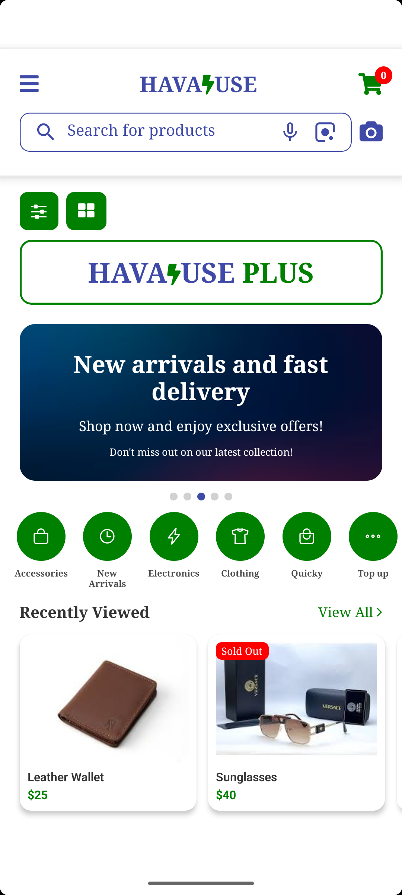
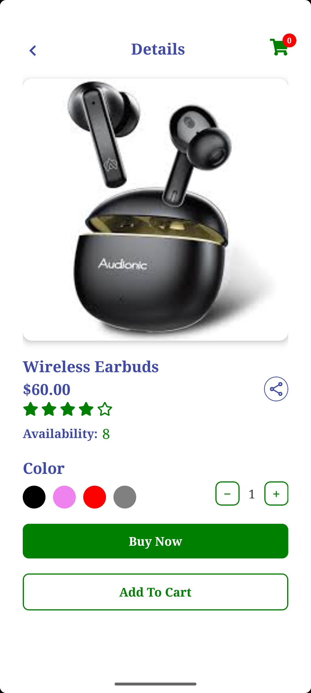

# DemoTask

DemoTask is a React Native mobile application for browsing and viewing products. The application provides product categories, product search, product details, cart functionality, quantity controls, and a responsive mobile interface.

The project is built with React Native and TypeScript and is intended primarily for Android development.

---

# Features

- Product browsing
- Product categories
- Product search
- Recently viewed products
- Product details
- Product images
- Product availability
- Product ratings
- Product color selection
- Quantity controls
- Add to Cart functionality
- Cart item badge
- Buy Now button
- Responsive layouts
- Android Emulator support
- Physical Android device support

---

# Tech Stack

- React Native `0.85.3`
- React `19.2.3`
- TypeScript
- React Navigation
- React Native Vector Icons
- React Native Safe Area Context
- Context API
- Node.js
- npm
- Android

---

# Requirements

Before running the project, make sure the following tools are installed and configured.

| Tool | Version / Requirement |
|------|------------------------|
| Node.js | `22.x` |
| npm | `10.x` or later |
| JDK | `17` |
| React Native | `0.85.3` |
| React | `19.2.3` |
| Android Studio | Required for Android development |
| Android SDK | Required |
| Android SDK Platform Tools | Required |
| Android Emulator | Required for emulator testing |

> **Important:** JDK 17 is recommended for this project. Make sure your `JAVA_HOME` points to the correct JDK installation.

---

# Check Installed Versions

Before installing the project dependencies, verify Node.js and Java:

```bash
node -v
npm -v
java -version
```


## Screenshots

<p align="center">
  
  
  
</p>
